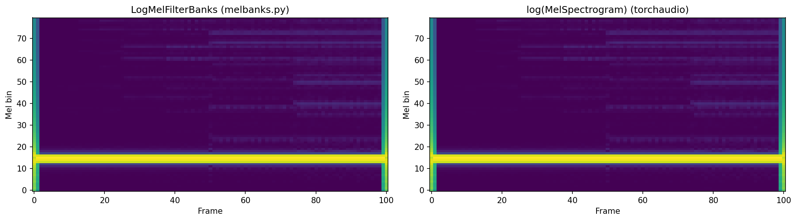
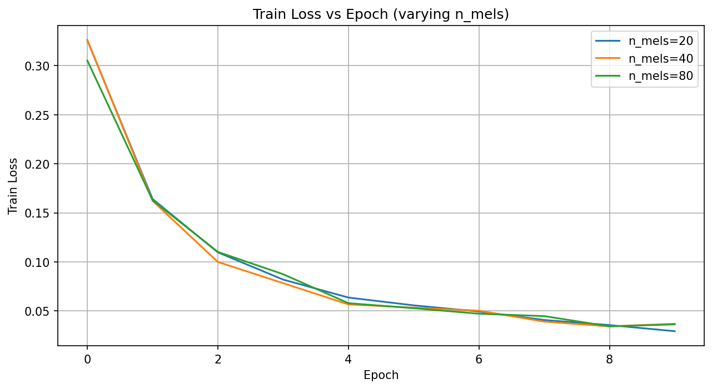
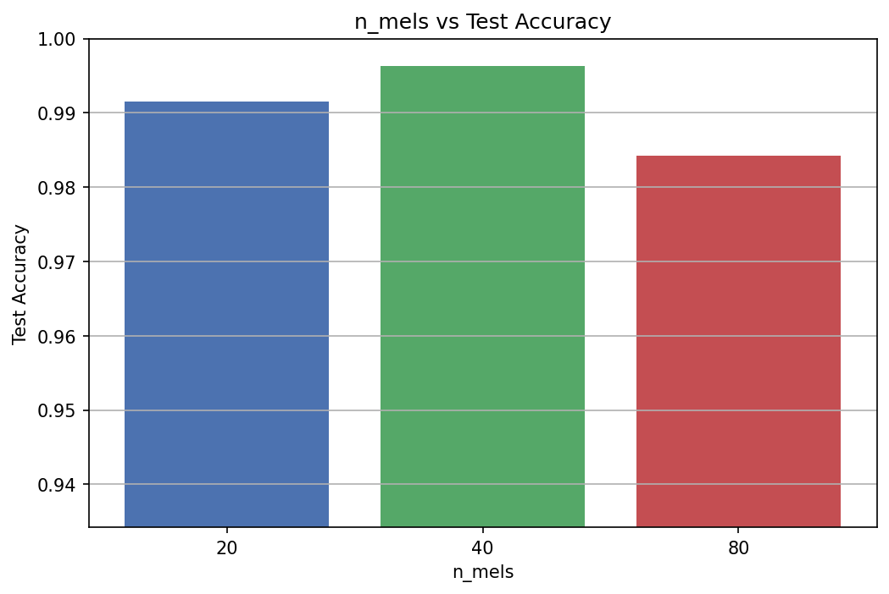
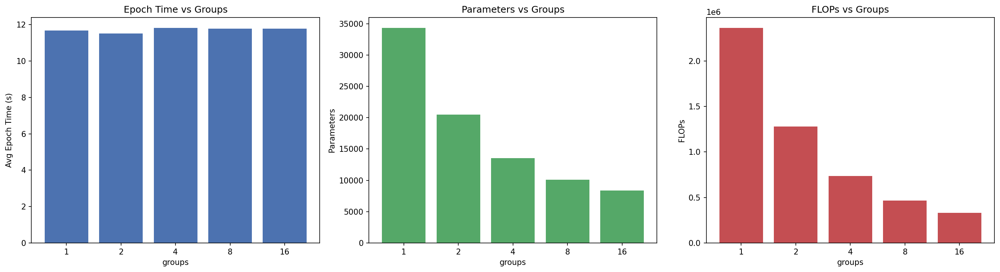
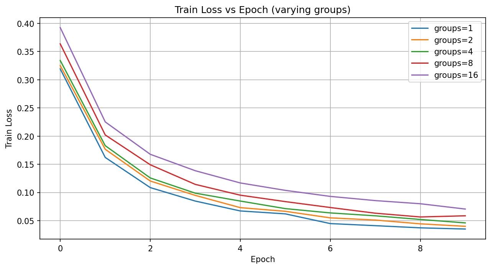
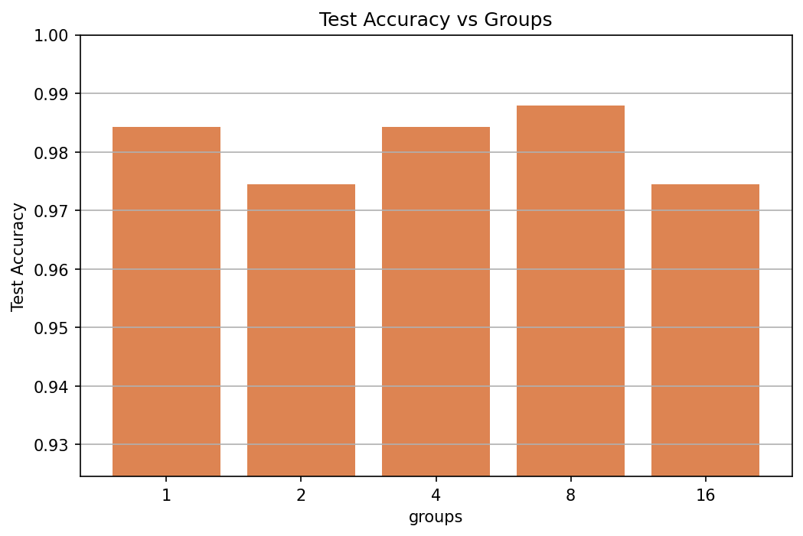

# Assignment 2. ASR Decoding — Report

## 1. LogMelFilterBanks Implementation

### Описание

Реализован PyTorch-слой `LogMelFilterBanks`, который извлекает логарифмы энергий мел-фильтров из сырого аудиосигнала.

### Верификация

Сравнение с `torchaudio.transforms.MelSpectrogram` на тестовом сигнале (синусоида 440 Гц, 1 сек, 16 kHz):

```
melspec = torchaudio.transforms.MelSpectrogram(hop_length=160, n_mels=80)(signal)
logmelbanks = LogMelFilterBanks()(signal)
assert torch.log(melspec + 1e-6).shape == logmelbanks.shape    # Успешно
assert torch.allclose(torch.log(melspec + 1e-6), logmelbanks)  # Успешно
```

### Визуальное сравнение



Графики идентичны, что подтверждает корректность реализации

---

## 2. Training Pipeline Setup

### Датасет

Использован `torchaudio.datasets.SPEECHCOMMANDS`. Отфильтрованы только **"yes"** и **"no"** для бинарной классификации.

| Split      | Samples | yes  | no   |
|------------|---------|------|------|
| Training   | 6358    | 3228 | 3130 |
| Validation | 803     | 397  | 406  |
| Testing    | 824     | 419  | 405  |

Все аудио приведены к длине 16000 отсчётов (1 сек) через padding нулями или обрезку.

### Архитектура модели

Простая CNN на основе `Conv1d`:

```
LogMelFilterBanks -> Conv1d(n_mels, 64) + BN + ReLU + MaxPool
                  -> Conv1d(64, 64) + BN + ReLU + MaxPool
                  -> Conv1d(64, 32) + BN + ReLU
                  -> Global Average Pooling
                  -> Linear(32, 1)
```

Baseline (n_mels=80, groups=1): **34 305 параметров** — укладывается в ограничение 100K.

### Обучение

- Optimizer: Adam, lr=1e-3
- Loss: BCEWithLogitsLoss
- Epochs: 10
- Batch size: 64

### Подсчёт параметров и FLOPs

- Параметры: `sum(p.numel() for p in model.parameters())`
- FLOPs: библиотека thop

---

## 3. Эксперимент: n_mels

Обучены 3 модели с `n_mels in {20, 40, 80}`, `groups=1`.

| n_mels | Parameters | Test Accuracy |
|--------|-----------|---------------|
| 20     | 22 785    | 0.9915        |
| 40     | 26 625    | **0.9964**    |
| 80     | 34 305    | 0.9842        |

### Train Loss



Все три варианта сходятся хорошо, loss монотонно уменьшается.

### Test Accuracy



### Выводы

- Лучший результат 99.64% у n_mels=40. Тут понятно, что больше фильтров не значит лучше.
- n_mels=20 даёт 99.15% — даже 20 фильтров достаточно для различения двух слов.
- n_mels=80 показал 98.42% — вероятно, модели с 34K параметрами не хватает ёмкости, чтобы эффективно использовать 80 каналов, и она слегка переобучается или хуже обобщает.
- Для бинарной задачи yes/no нет смысла брать много мел-фильтров. Оптимум — в районе 40.

**Baseline для следующего эксперимента: n_mels=80** (чтобы `groups` делился нацело на количество каналов).

---

## 4. Эксперимент: groups

Обучены 5 моделей с `groups in {1, 2, 4, 8, 16}`, `n_mels=80`.

| groups | Parameters | FLOPs     | Avg Epoch Time (s) | Test Accuracy |
|--------|-----------|-----------|---------------------|---------------|
| 1      | 34 305    | 2 361 248 | 11.7                | 0.9842        |
| 2      | 20 481    | 1 278 368 | 11.5                | 0.9745        |
| 4      | 13 569    | 736 928   | 11.8                | 0.9842        |
| 8      | 10 113    | 466 208   | 11.8                | **0.9879**    |
| 16     | 8 385     | 330 848   | 11.8                | 0.9745        |

### Метрики vs Groups



### Train Loss



### Test Accuracy



### Выводы

- Параметры и FLOPs уменьшаются почти линейно с ростом groups. groups=16 даёт в 4 раза меньше параметров и в 7 раз меньше FLOPs по сравнению с groups=1.
- Epoch time практически не меняется (11.5–11.8 с). На CPU разница в FLOPs не даёт заметного ускорения, потому что рассходы от загрузки данных и мел-преобразования доминируют. На GPU разница была бы заметнее.
- Accuracy: groups=8 показал лучший результат (98.79%), что удивительно — с меньшим числом параметров модель обобщает лучше.
- groups=16 уже теряет в качестве (97.45%) — слишком мало связей между каналами, модель не может выучить достаточно сложные паттерны.
- Для простой бинарной задачи групповые свёртки — хороший выбор: можно сильно сократить модель без потери качества.

---

Все точные значения метрик и тд указаны в logs/log (на графиках точность упразднена для меньшего визуального шума)
