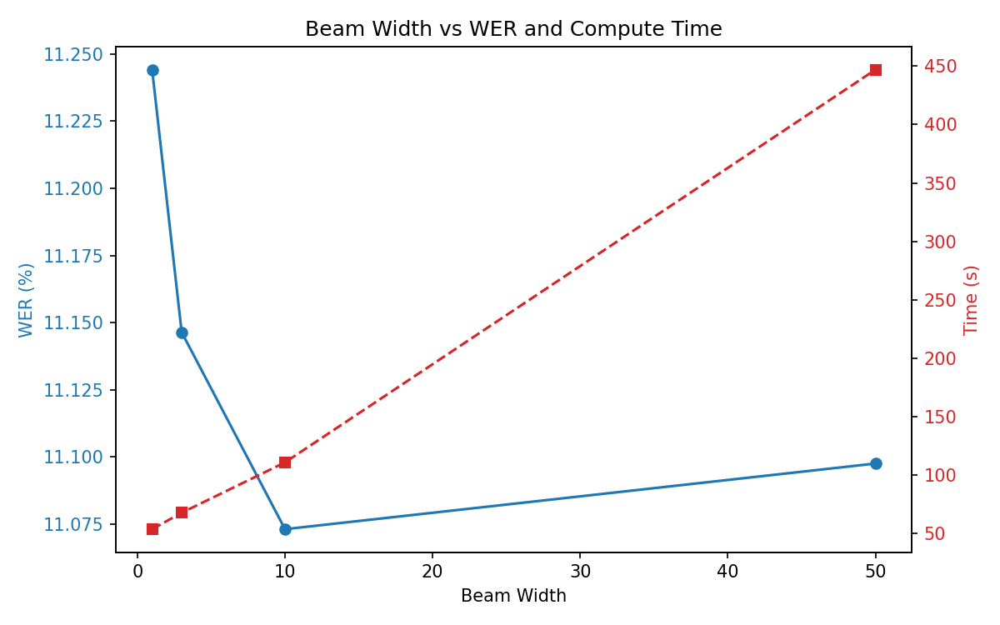
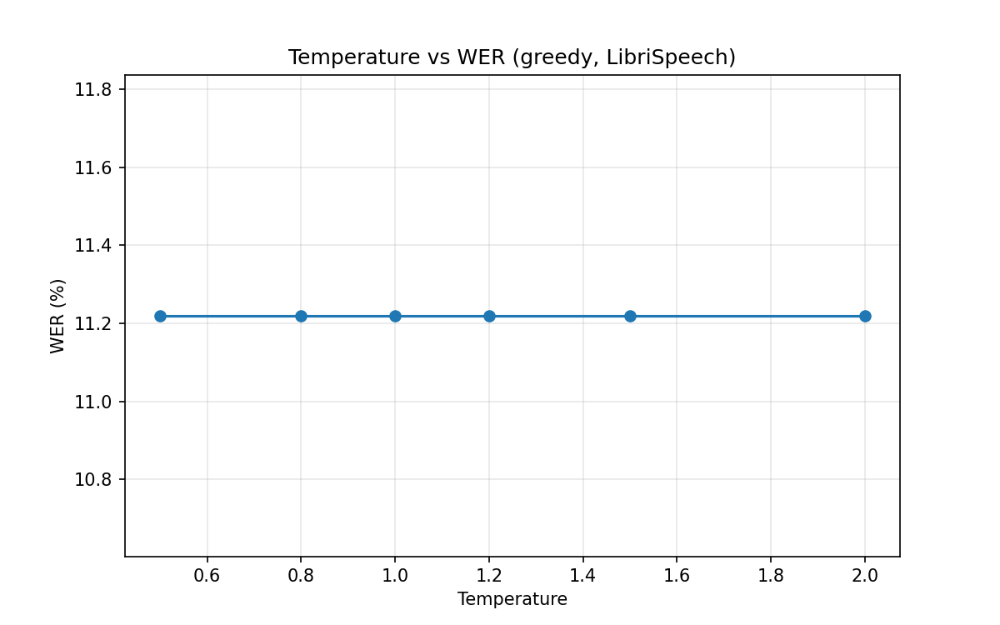
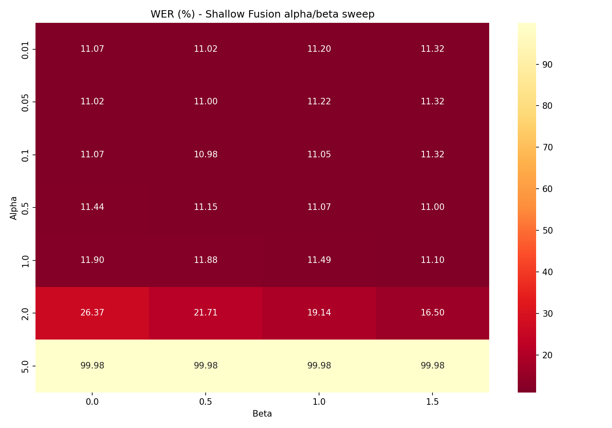
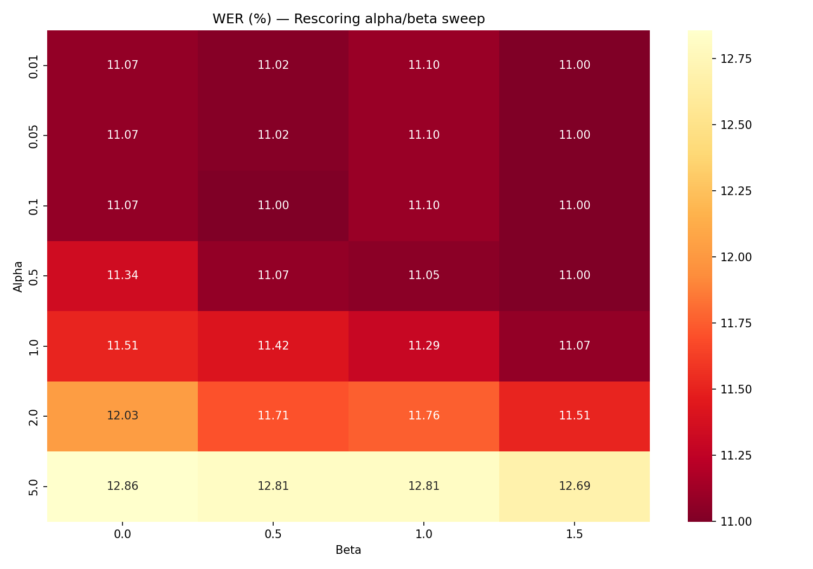
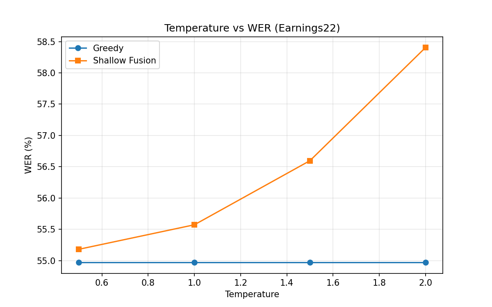
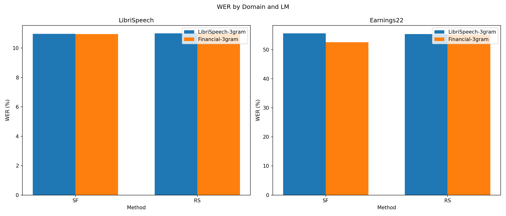

# Assignment 2. Digital Signal Processing - Report

## 1. Greedy Decoding

Реализован жадный декодер, который на каждом временном шаге выбирает токен с максимальной вероятностью из лог-вероятностей, полученных после применения log_softmax к лог-маскам акустической модели. Затем выполняется сворачивание повторяющихся символов и удаление <pad>.

| Method   | WER (%) | CER (%) |
|----------|---------|---------|
| Greedy   | 11.22   | 3.81    |

Референсные значения WER = 10.4%, CER = 3.5%.

Полученные метрики близки к референсным, что подтверждает корректность реализации жадного декодирования.

## 2. Beam Search Decoding

Реализован декодер на основе лучевого поиска. На каждом временном шаге хранятся beam_width наиболее вероятных гипотез. В конце каждой гипотезы выполнено сворачивание повторяющихся символов и удаление <pad>. Время выполнения измерено для всего тестового набора (200 аудио).

| Beam width | WER (%) | CER (%) | Время (с) |
|------------|---------|---------|-----------|
| 1          | 11.24   | 3.80    | 53.7      |
| 3          | 11.15   | 3.78    | 67.8      |
| 10         | 11.07   | 3.77    | 110.9     |
| 50         | 11.10   | 3.77    | 447.0     |

Увеличение ширины луча с 1 до 10 снижает WER на 0.17% (с 11.24% до 11.07%) и CER на 0.03%.

При дальнейшем увеличении ширины до 50 качество практически не улучшается, но время выполнения возрастает в 4 раза по сравнению с шириной 10.

Наилучшее качество достигается при beam_width = 10. Дальнейшее увеличение луча нецелесообразно из-за резкого роста вычислительных затрат.

## 3. Temperature scaling

Применена температурная нормализация лог-вероятностей. Исследовано влияние температуры на жадное декодирование. Ожидалось, что изменение температуры изменит распределение вероятностей и повлияет на качество распознавания.

| Temperature T | WER (%) | CER (%) |
|---------------|---------|---------|
| 0.5           | 11.22   | 3.81    |
| 0.8           | 11.22   | 3.81    |
| 1.0           | 11.22   | 3.81    |
| 1.2           | 11.22   | 3.81    |
| 1.5           | 11.22   | 3.81    |
| 2.0           | 11.22   | 3.81    |

Изменение температуры не влияет на результат жадного декодирования. Все метрики остаются неизменными во всём диапазоне температур.

Это объясняется тем, что жадный декодер выбирает аргумент максимума распределения/

Температура масштабирует лог-вероятности линейно, не меняя порядок максимумов.

## 4. Shallow fusion

Реализована shallow fusion с предоставленной 3-gram KenLM моделью.

Сетка параметров:
alpha in {0.01, 0.05, 0.1, 0.5, 1.0, 2.0, 5.0}
beta in {0.0, 0.5, 1.0, 1.5}

Ширина луча фиксирована: beam_width = 10.

| alpha \ beta | 0.0   | 0.5   | 1.0   | 1.5   |
|--------------|-------|-------|-------|-------|
| 0.01         | 11.07 | 11.02 | 11.20 | 11.32 |
| 0.05         | 11.02 | 11.00 | 11.22 | 11.32 |
| 0.1          | 11.07 | 10.98 | 11.05 | 11.32 |
| 0.5          | 11.44 | 11.15 | 11.07 | 11.00 |
| 1.0          | 11.90 | 11.88 | 11.49 | 11.10 |
| 2.0          | 26.37 | 21.71 | 19.14 | 16.50 |
| 5.0          | 99.98 | 99.98 | 99.98 | 99.98 |

Наилучшая конфигурация alpha = 0.1, beta = 0.5 даёт WER = 10.98%, CER = 3.74%.

## 5. 4-gram LM

Загружена 4-gram LM и применен sf с параметрами, найденными для 3-gram в прошлой таске.

| LM      | WER (%) | CER (%) |
|---------|---------|---------|
| 3-gram  | 10.98   | 3.74    |
| 4-gram  | 11.02   | 3.75    |

Увеличение порядка LM с 3-gram до 4-gram не привело к улучшению качества. Напротив, WER незначительно вырос

## 6. LM rescoring

Реализован двухпроходный подход LM rescoring. На первом этапе выполняется beam search без языковой модели (beam_width = 10), формируется набор гипотез. На втором этапе каждая гипотеза пересчитывается с использованием языковой модели

| alpha \ beta | 0.0   | 0.5   | 1.0   | 1.5   |
|--------------|-------|-------|-------|-------|
| 0.01         | 11.07 | 11.02 | 11.10 | 11.00 |
| 0.05         | 11.07 | 11.02 | 11.10 | 11.00 |
| 0.1          | 11.07 | 11.00 | 11.10 | 11.00 |
| 0.5          | 11.34 | 11.07 | 11.05 | 11.00 |
| 1.0          | 11.51 | 11.42 | 11.29 | 11.07 |
| 2.0          | 12.03 | 11.71 | 11.76 | 11.51 |
| 5.0          | 12.86 | 12.81 | 12.81 | 12.69 |

Наилучшая конфигурация alpha = 0.01, beta = 1.5 даёт WER = 11.00%, CER = 3.74%.

Сравнение с sf из 4 таски

| Метод          | Лучший WER (%)                    | Устойчивость при alpha=5.0                     |
|----------------|-----------------------------------|------------------------------------------------|
| Shallow fusion | 10.98 (alpha=0.1, beta=0.5)       | WER = 99.98% (полная деградация)               |
| Rescoring      | 11.00 (alpha=0.01, beta=1.5)      | WER = 12.69% (умеренное ухудшение)             |

Устойчивость к большим значениям alpha

При alpha=5.0 sf полностью разрушает качество (WER почти 100%), тогда как rescoring сохраняет приемлемый уровень (WER около 12%). Это объясняется тем, что в sf LM участвует в процессе поиска гипотез, и при высоком весе акустическая модель перестаёт влиять на формирование луча. В rescoring же гипотезы уже сформированы без LM, и даже при большом alpha пересчёт лишь меняет их порядок, но не отбрасывает акустически правдоподобные варианты

Далее идет качественный анализ транскрипций, вот примеры:

Пример 1:

REF: the kick he had received was a foretaste of what he might expect and after a little consideration he came to the conclusion that his duty was to escape and get back to the cutter as quickly as he could

BEAM: the kickhe had received was a foretaste of what he might expect and after a little consideration he came to the conclusion that his duty was to escape and get back to the cutter as quickly as he could

SF: the kickhe had received was a foretaste of what he might expect and after a little consideration he came to the conclusion that his duty was to escape and get back to the cutter as quickly as he could (correct)

RS: the kick he had received was a fore taste of what he might expect and after a little consideration he came to the conclusion that his duty was to escape and get back to the cutter as quickly as he could (correct)

Пример 2:

REF: a fellow who was shut up in prison for life might do it he said but not in a case like this

BEAM: a fellow who as shut up in prison for life might doit he said but not in a case like this

SF: a fellow who as shut up in prison for life might do it he said but not in a case like this (correct)

RS: a fellow who as shut up in prison for life might do it he said but not in a case like this (correct)

REF: stop here till sir risdon comes down and tell him i'm very sorry that we should have cleared out last night only a born fool saw jerry nandy's lobster boat coming into the cove and came running to say it was a party from the cutter yes father

Пример 3:

BEAM: stop here till sir rysdon comes down and tell him i'm very sorry that we shoul have cleared out last night only a born fool saw jerry nandy's lobsterboat coming into the cove and came running to say it was a party from the cutter yes father

SF: stop here till sir rysdon comes down and tell him i'm very sorry that we shoul have cleared out last night only a born fool saw jerry nandy's lobsterboat coming into the cove and came running to say it was a party from the cutter yes father (correct)

RS: stop here till sir rysdon comes down and tell him i'm very sorry that we shoul have cleared out last night only a born fool saw jerry nandy's lobster boat coming into the cove and came running to say it was a party from the cutter yes father (correct)

Пример 4:

REF: and why did andy call mister gurr father

BEAM: and why did andy call mister gurfather

SF: and why did andy call mister gur father (correct)

RS: and why did andy call mister gur father (correct)

Какие ошибки LM склонен исправлять?

1. Отсутствие пробелов между словами (слияние):
- kickhe -> kick he (пример 1)

- doit -> do it (пример 2)

- gurfather -> gur father (пример 4)
2. Разделение составных слов:
- lobsterboat -> lobster boat (пример 3)

Какие ошибки LM не исправляет или делает хуже?

1. Акустически похожие, но грамматически/лексически неверные слова
- as вместо was (пример 2, 3)

- rysdon вместо risdon (пример 3)
2. Опечатки
- shoul вместо should (пример 3)
3. Внесение новых ошибок
- В rescoring foretaste -> fore taste (пример 1)
  
Есть ли случаи, когда shallow fusion и rescoring расходятся?

SF: lobsterboat остаётся слитным (не исправлено)

RS: lobsterboat -> lobster boat (исправлено)

## 7. Оценка на out-of-domain

Применены лучшие конфигурации для каждого метода на тестовом наборе Earnings22

| Method        | LibriSpeech WER | LibriSpeech CER | Earnings22 WER | Earnings22 CER |
|---------------|-----------------|-----------------|----------------|----------------|
| Greedy        | 11.22           | 3.81            | 54.97          | 25.58          |
| Beam search   | 11.07           | 3.77            | 54.94          | 25.38          |
| SF            | 10.98           | 3.74            | 55.57          | 25.47          |
| RS            | 11.00           | 3.74            | 55.33          | 25.38          |

На LibriSpeech WER составляет 11%, на Earnings22 55%. Разница более 44% абсолютного WER. CER также вырос с 3.7% до 25%.

Модель wav2vec2-base-100h обучена на LibriSpeech чистой, хорошо записанной книжной речи. Earnings22 содержит реальные финансовые конференц-звонки: фоновый шум, различные микрофоны, акценты, перебивания, неформальная речь. Акустическая модель не адаптирована к таким условиям.

Из таблицы видно, что shallow fusion и rescoring на Earnings22 не улучшают качество по сравнению с чистым beam search:

- SF даёт WER 55.57% (хуже, чем 54.94% у beam)
- RS даёт WER 55.33% (незначительно хуже)

LM обучена на домене, не соответствующем целевому. Вероятности, которые она присваивает финансовым терминам, близки к нулю, поэтому при sf такие гипотезы штрафуются.

Вывод: Для out-of-domain данных необходима либо файн тюнинг акустической модели, либо использование доменно-специфичной языковой модели

## 7b. Влияние температуры на out-of-domain

Проведён эксперимент с температурным масштабированием на тестовом наборе Earnings22.

| T   | Greedy | Shallow Fusion |
|-----|--------|----------------|
| 0.5 | 54.97  | 55.18          |
| 1.0 | 54.97  | 55.57          |
| 1.5 | 54.97  | 56.60          |
| 2.0 | 54.97  | 58.40          |

1. Greedy decoding
WER остаётся неизменным (54.97%) при всех значениях температуры, как уже ранее и было проверено

2. Shallow fusion
С ростом температуры качество монотонно ухудшается.
Лучший результат достигается при T = 0.5 (WER = 55.18%), худший при T = 2.0 (WER = 58.40%).

Вопросы из задания:

**Помогает ли более высокая температура LM fusion на out-of-domain речи?**

Нет. Рост температуры монотонно ухудшает WER shallow fusion на Earnings22. Повышение T делает распределение акустической модели более равномерным, усиливая относительное влияние LM. Но LibriSpeech LM не знает финансовых терминов и её усиленное влияние только вредит.

**Одинаково ли ведёт себя акустическая модель на LibriSpeech и Earnings22?**

На LibriSpeech модель хорошо откалибрована: T = 1 оптимально, T > 1 только ухудшает результат. На Earnings22 акустическая модель не обучалась на финансовой речи и выдаёт неуверенные/неверные предсказания даже при T = 1. При этом снижение уверенности через T > 1 не помогает, так как LM тоже не подходит для этого домена и оба компонента ошибаются.

## 8. Финансовая языковая модель

Обучена 3-gram KenLM на корпусе `data/earnings22_train/corpus.txt`.

Сборку KenLM выполнял в Google Colab (на arch не удалось собрать из-за конфликтов зависимостей).

## 9. Сравнение LM на обоих доменах

Применены SF и RS с двумя LM (LibriSpeech 3-gram и финансовая 3-gram) на обоих тестовых наборах. Параметры лучшие из задач 4 и 6.

| Domain      | LM                 | Method | WER (%) | CER (%) |
|-------------|-------------------|--------|---------|---------|
| LibriSpeech | LibriSpeech-3gram | SF     | 10.98   | 3.74    |
| LibriSpeech | LibriSpeech-3gram | RS     | 11.00   | 3.74    |
| LibriSpeech | Financial-3gram   | SF     | 10.95   | 3.77    |
| LibriSpeech | Financial-3gram   | RS     | 11.00   | 3.74    |
| Earnings22  | LibriSpeech-3gram | SF     | 55.57   | 25.47   |
| Earnings22  | LibriSpeech-3gram | RS     | 55.33   | 25.38   |
| Earnings22  | Financial-3gram   | SF     | 52.56   | 25.12   |
| Earnings22  | Financial-3gram   | RS     | 55.18   | 25.36   |

Какая LM лучше in-domain?

На LibriSpeech обе LM дают практически одинаковый результат (WER около 11%). Разница в пределах шума измерений.

Какая LM лучше out-of-domain?

На Earnings22 финансовая LM заметно улучшает SF. WER снижается с 55.57% до 52.56%. При rescoring улучшение меньше с 55.33% до 55.18%.

Доменноспецифичная и более крупная общая LM.

Финансовая 3-gram, обученная на примерно 100к слов, превзошла LibriSpeech 3-gram на финансовом домене. Доменное соответствие LM важнее её размера.

SF выигрывает от финансовой LM больше чем RS. При sf модель влияет на каждый шаг поиска и продвигает финансовые термины с самого начала. При RS гипотезы уже сформированы без нужных слов и если слово не попало в луч, исправить это невозможно.
